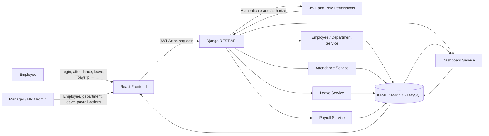

# HRGenius Data Flow Diagram

```mermaid
flowchart LR
    Employee[Employee] -->|Login, attendance, leave, payslip| React[React Frontend]
    Manager[Manager / HR / Admin] -->|Employee, department, leave, payroll actions| React

    React -->|JWT Axios requests| API[Django REST API]
    API -->|Authenticate and authorize| Auth[JWT and Role Permissions]
    Auth --> API

    API --> Employees[Employee / Department Service]
    API --> Attendance[Attendance Service]
    API --> Leaves[Leave Service]
    API --> Payroll[Payroll Service]
    API --> Dashboard[Dashboard Service]

    Employees --> DB[(XAMPP MariaDB / MySQL)]
    Attendance --> DB
    Leaves --> DB
    Payroll --> DB
    Dashboard --> DB

    DB --> Dashboard
    DB --> React
```
