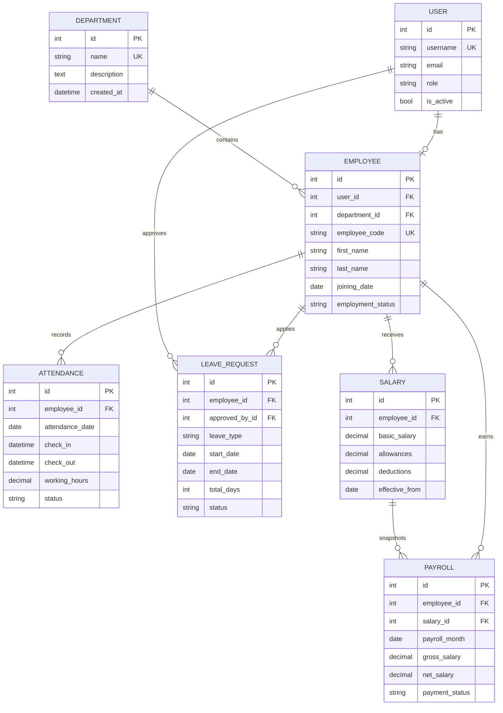

# HRGenius Entity Relationship Diagram

```mermaid
erDiagram
    USER ||--o| EMPLOYEE : has
    DEPARTMENT ||--o{ EMPLOYEE : contains
    EMPLOYEE ||--o{ ATTENDANCE : records
    EMPLOYEE ||--o{ LEAVE_REQUEST : applies
    USER ||--o{ LEAVE_REQUEST : approves
    EMPLOYEE ||--o{ SALARY : receives
    EMPLOYEE ||--o{ PAYROLL : earns
    SALARY ||--o{ PAYROLL : snapshots

    USER {
        int id PK
        string username UK
        string email
        string role
        bool is_active
    }

    DEPARTMENT {
        int id PK
        string name UK
        text description
        datetime created_at
    }

    EMPLOYEE {
        int id PK
        int user_id FK
        int department_id FK
        string employee_code UK
        string first_name
        string last_name
        date joining_date
        string employment_status
    }

    ATTENDANCE {
        int id PK
        int employee_id FK
        date attendance_date
        datetime check_in
        datetime check_out
        decimal working_hours
        string status
    }

    LEAVE_REQUEST {
        int id PK
        int employee_id FK
        int approved_by_id FK
        string leave_type
        date start_date
        date end_date
        int total_days
        string status
    }

    SALARY {
        int id PK
        int employee_id FK
        decimal basic_salary
        decimal allowances
        decimal deductions
        date effective_from
    }

    PAYROLL {
        int id PK
        int employee_id FK
        int salary_id FK
        date payroll_month
        decimal gross_salary
        decimal net_salary
        string payment_status
    }
```
