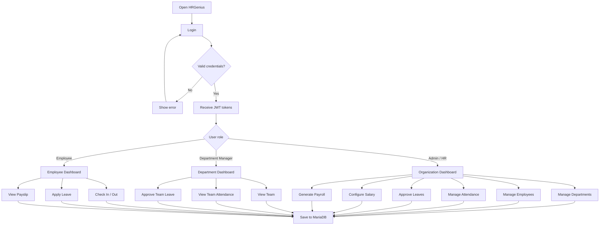

# HRGenius System Flowchart

```mermaid
flowchart TD
    A[Open HRGenius] --> B[Login]
    B --> C{Valid credentials?}
    C -->|No| D[Show error]
    D --> B
    C -->|Yes| E[Receive JWT tokens]
    E --> F{User role}

    F -->|Admin / HR| G[Organization Dashboard]
    F -->|Department Manager| H[Department Dashboard]
    F -->|Employee| I[Employee Dashboard]

    G --> J[Manage Departments]
    G --> K[Manage Employees]
    G --> L[Manage Attendance]
    G --> M[Approve Leaves]
    G --> N[Configure Salary]
    G --> O[Generate Payroll]

    H --> P[View Team]
    H --> Q[View Team Attendance]
    H --> R[Approve Team Leave]

    I --> S[Check In / Out]
    I --> T[Apply Leave]
    I --> U[View Payslip]

    J --> V[Save to MariaDB]
    K --> V
    L --> V
    M --> V
    N --> V
    O --> V
    P --> V
    Q --> V
    R --> V
    S --> V
    T --> V
    U --> V
```
